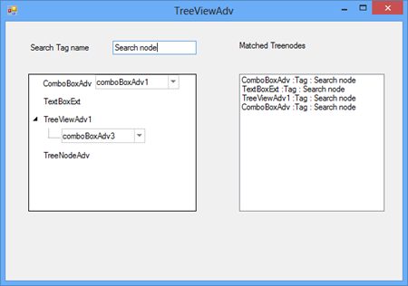

# How to search tree node based on its tag value in winforms treeviewadv?

## Search TreeNodeAdv based on its tag value

In **TreeViewAdv**, you can filter **TreeNodeAdv** based on its Tag value. The following code example demonstrates the same.

**C# Code Snippet:**

```C#
List<TreeNodeAdv> nodes;
//To search all nodes
nodes = treeViewAdv1.SearchTree().Where(n => n.Tag == "Search node").ToList();
public static class SOExtension
{
    public static IEnumerable<TreeNodeAdv> SearchTree(this TreeViewAdv treeView)
    {
        return SearchTree(treeView.Nodes);
    }
    public static IEnumerable<TreeNodeAdv> SearchTree(this TreeNodeAdvCollection coll)
    {
        return coll.Cast<TreeNodeAdv>().Concat(coll.Cast<TreeNodeAdv>().SelectMany(x => SearchTree(x.Nodes)));
    }
}

```

**VB Code Snippet:**

```VB
Private nodes As List(Of TreeNodeAdv)
'To search all nodes
nodes = treeViewAdv1.FlattenTree().Where(Function(n) n.Tag = "Search node").ToList()
Public Module SOExtension
    <System.Runtime.CompilerServices.Extension()> _
    Public Function SearchTree(ByVal treeView As TreeViewAdv) As IEnumerable(Of TreeNodeAdv)
        Return SearchTree(treeView.Nodes)
    End Function
    <System.Runtime.CompilerServices.Extension()> _
    Public Function SearchTree(ByVal coll As TreeNodeAdvCollection) As IEnumerable(Of TreeNodeAdv)
        Return coll.Cast(Of TreeNodeAdv)().Concat(coll.Cast(Of TreeNodeAdv)().SelectMany(Function(x) SearchTree(x.Nodes)))
    End Function
End Module

```

The following screenshot illustrates the search TreeNodeAdv by using its Tag value.
 


